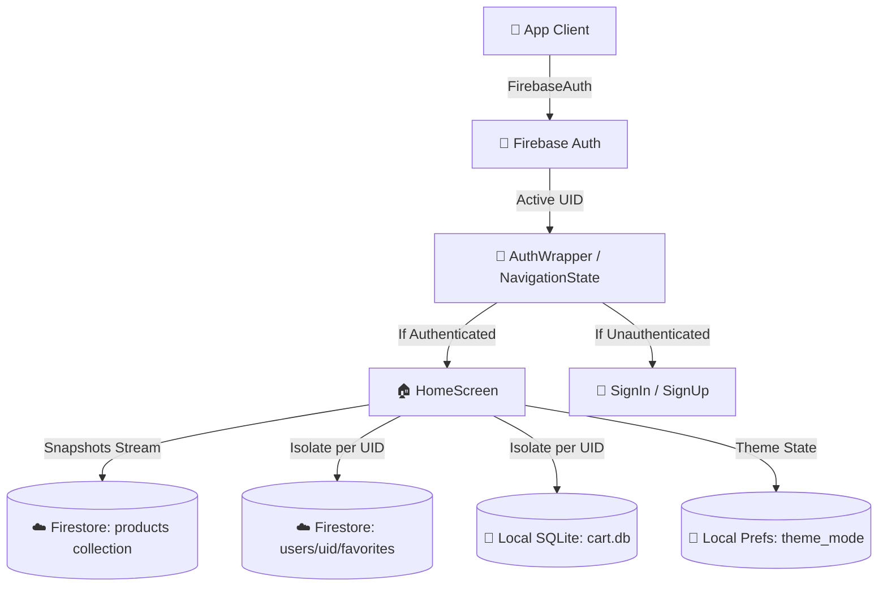

# 🌊 Flutter E-Commerce Application

🌐 **Live Demo:** [e-commerce-app-nabeeh-mohammed.netlify.app](https://e-commerce-nabeeh-v4.netlify.app/)

 E-Commerce Application is a high-performance, visually stunning, and feature-rich e-commerce mobile application built using the **Flutter SDK** and **Dart**. Adhering to the premium **"Aurora Glass"** UI design language, it utilizes vibrant gradients, subtle micro-animations, premium custom glassmorphic loading indicators, and modern typography to deliver a state-of-the-art shopping experience.

Powered by **Provider** for clean state management and integrated deeply with **Google Firebase**, ShopWave offers seamless real-time database syncing, multi-user isolation, secure cloud wishlists, and isolated shopping carts.

---

## 🚀 Key Features

*   **Secure Multi-User Authentication:** Integrated with **Firebase Authentication** supporting real-time validation for SignUp and SignIn. Secure session state is actively tracked at the root level using a reactive `StreamBuilder`.
*   **Real-time Database Syncing:** Product lists, categories, and inventories are streamed live from **Cloud Firestore** using `snapshots()`. This ensures that price changes, discounts, and inventory counts are updated instantly across all devices.
*   **User-Specific Cloud Favorites (Exercise 3):** Wishlist items are isolated securely in the cloud under `users/{userId}/favorites`. Changes are managed through `set()`, `update()`, and `delete()`, synced in real-time, and supported by Firestore's offline cache.
*   **Offline Shopping Cart (SQLite - Exercise 4):** Shopping cart items are now persisted locally using **sqflite**. By listening to auth changes, the cart isolates data on a per-user basis within a local SQLite database (`cart_items` table), ensuring items remain even after closing the app or device restart.
*   **Persistent Theme Management (Exercise 4):** Integrated a system-wide Theme management system using **shared_preferences**. Users can toggle between Light and Dark modes in their profile, and the preference is saved locally for future sessions.
*   **Automatic Cloud Database Seeding:** Built-in smart seeder that automatically populates the remote database with high-quality products upon first startup if Firestore is empty.
*   **Cohesive Premium UI & Navigation:** 
    *   Dynamic background profile loading that updates and reloads credentials in real-time.
    *   System-wide theme-aware components that automatically adapt gradients, text colors, and backgrounds based on the selected mode.
    *   Stateful global tab indices that automatically reset to `0` (Home screen) on session changes.

---

## 🏗️ Architecture & Data Flow



---

## 🛠️ State Management Architecture

E-Commerce Application utilizes the **Provider** design pattern to decouple UI presentation from business logic. The application is initialized under a global `MultiProvider` tree:

```dart
MultiProvider(
  providers: [
    ChangeNotifierProvider(create: (_) => ProductProvider()),
    ChangeNotifierProvider(create: (_) => CartProvider()),
    ChangeNotifierProvider(create: (_) => FavoriteProvider()),
    ChangeNotifierProvider(create: (_) => NavigationProvider()),
    ChangeNotifierProvider(create: (_) => ThemeProvider()), // Persistence added
  ],
  child: const MyApp(),
);
```

### State Components
1.  **ProductProvider:** Streams live inventory data from Firestore, handles caching fallbacks, and executes background synchronization.
2.  **CartProvider:** Implements shopping cart logic using **sqflite**. It isolates cart items by `userId` to ensure privacy and persists them across app restarts.
3.  **FavoriteProvider:** Listens to authentication state changes to dynamically subscribe/unsubscribe to the live user-specific cloud stream (`users/{userId}/favorites`).
4.  **ThemeProvider:** Manages the application's `ThemeMode` (Light/Dark/System). Uses **shared_preferences** to persist the user's choice locally.
5.  **NavigationProvider:** Manages active tab indices and provides unified triggers for screen transitions.

---

## 🎓 Executed Laboratories & Exercises

### 🏆 Exercise 1 — Connect Your App to Firebase
*   Configured Firebase Core and enabled Email/Password Sign-In methods.
*   Built premium `SignInScreen` and `SignUpScreen` with form validators.
*   Implemented `AuthWrapper` using `StreamBuilder` for dynamic session state switching.

### 🏆 Exercise 2 — Move Data to Cloud Database
*   Migrated mock data setup to a fully cloud-backed architecture using **Cloud Firestore**.
*   Built robust serialization mappers `Product.fromDoc()` and `Product.toMap()`.
*   Implemented automated database seeding inside `ProductProvider`.

### 🏆 Exercise 3 — Personal Favorites with Firebase
*   Created isolated subcollections for user favorites (`users/{userId}/favorites`).
*   Configured `snapshots()` on `FavoriteProvider` to stream live updates.
*   Leveraged Firestore's native cache for offline availability.

### 🏆 Exercise 4 — Local Persistence & UI Polish
*   **SQFlite Integration:** Replaced JSON file persistence with a structured SQLite database for the shopping cart (`cart_items` table).
*   **Data Isolation:** Implemented logic to filter cart items by the active `userId` to handle sessions smoothly.
*   **Shared Preferences:** Implemented theme persistence to remember user appearance settings, establishing **Light Mode** as the default choice upon first installation.
*   **Dynamic Theme & Visibility Fixes:** Polished the entire UI layer to use `Theme.of(context)` for automatic adaptation:
    *   Fixed critical text readability issues in authentication forms (`SignInScreen` & `SignUpScreen`) when Dark Mode is active.
    *   Enhanced category cards (especially the **Gaming** category) and product quantity indicators to guarantee high visibility and contrast during Dark Mode.

---

## 🛠️ Technology Stack & Libraries

*   **Framework:** Flutter (Dart)
*   **State Management:** Provider
*   **Authentication:** Firebase Auth
*   **Database (Cloud):** Cloud Firestore
*   **Database (Local):** SQFlite (sqflite)
*   **Local Settings:** SharedPreferences
*   **Design Tokens:** Google Fonts (Outfit, Inter), Dynamic Theme Support, Glassmorphism.
